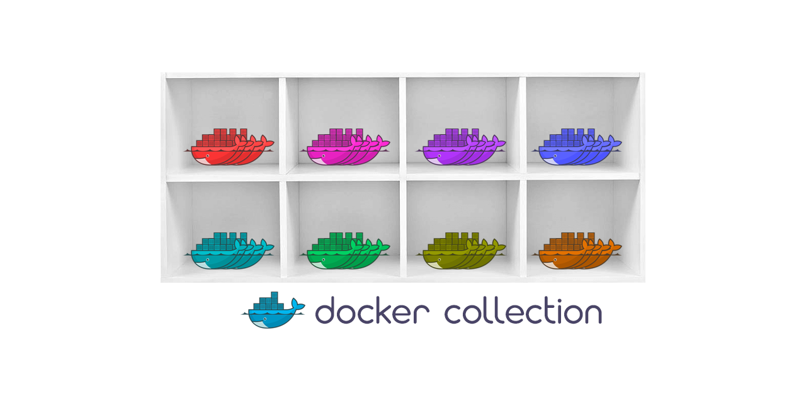

# Docker collection



Collection of Dockerfiles for existing projects/papers I tested — useful as a starting point for your own experiments. Adapt the Dockerfiles and running scripts to your needs.

<br>

# Instructions

Each project/paper implementation consists of 3 files:
- Dockerfile
- build.sh
- run.sh
- README

and optional additional files (such as python requirements.txt, conda environemnts.yml, etc.). 

The idea is to build the docker image from the Dockerfile using `build.sh` and run the docker container using `run.sh`. For a project `SELECTED-PROJECT` run the following:

```
cd dockers/SELECTED-PROJECT
sh build.sh
sh run.sh CODE-PATH DATA-PATH
```
where `CODE-PATH` is the path to the code from the original GitHub repository, and `DATA-PATH` is the <ins>optional</ins> path to the datasets location you want to use in the docker container.

<br>

# Implementations

The implmemented projects/papers are listed in the table below. The files for a selected project are located in `dockers/<Location>`, where `<Location>` is listed in the table.


| Reference | Paper                                                       | Topic | Link                                         | GitHub                                             | Location     |
|-----------|-------------------------------------------------------------|-------|----------------------------------------------|----------------------------------------------------|--------------|
| [1]         | iNeRF: Inverting Neural Radiance Fields for Pose Estimation | NERFs | [link](https://arxiv.org/pdf/2012.05877.pdf) | [repo](https://github.com/yenchenlin/iNeRF-public) | iNeRF-public |
| [2]         | SC^2-PCR: A Second Order Spatial Compatibility for Efficient and Robust Point Cloud Registration | 3D Registration | [link](https://openaccess.thecvf.com/content/CVPR2022/papers/Chen_SC2-PCR_A_Second_Order_Spatial_Compatibility_for_Efficient_and_Robust_CVPR_2022_paper.pdf) | [repo](https://github.com/ZhiChen902/SC2-PCR) | SC2-PCR             |
| [3]         | Humans in 4D: Reconstructing and Tracking Humans with Transformers                                                   |  SMPL fitting     | [link](https://arxiv.org/pdf/2305.20091.pdf) |   [repo](https://github.com/shubham-goel/4D-Humans)  | 4D-Humans
|           |                                                             |       |                                              |                                                    |              
<br>

# ToDo
- [ ] Add GeDi docker
- [ ] Add SpinNet docker
- [ ] Add GeoTransformer docker
- [ ] Add PointDSC docker
- [ ] Add YOHO docker
- [x] Add SC2-PCR docker
- [x] Add 4D-Humans docker

<br>

# References
[1] Yen-Chen et al.: iNeRF: Inverting Neural Radiance Fields for Pose Estimation, IROS 2021 <br>
[2] Chen et al.: SC^2-PCR: A Second Order Spatial Compatibility for Efficient and Robust Point Cloud Registration, CVPR 2022 <br>
[3] Goel et al.: Humans in 4D: Reconstructing and Tracking Humans with Transformers, arXiv preprint
